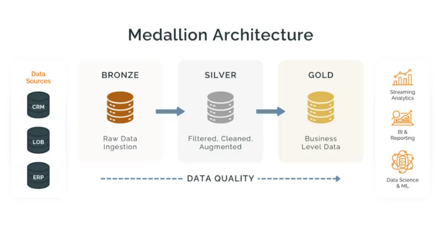
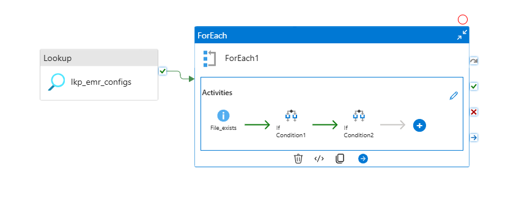
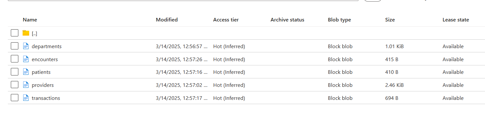
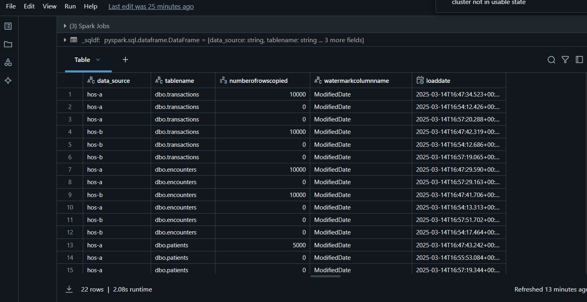

# Healthcare RCM Data Pipeline - Azure Data Engineering

## Overview
This repository contains an end-to-end **Azure Data Engineering pipeline** designed for **Healthcare Revenue Cycle Management (RCM)**. The project follows the **Medallion Architecture (Bronze, Silver, Gold)** to process **Electronic Medical Records (EMR), Claims Data, and ICD/CPT Codes**, enabling data-driven insights for financial management in healthcare.

## Technology Stack
- **Azure Data Factory (ADF)** - Data ingestion from various sources.
- **Azure Data Lake Storage (ADLS Gen2)** - Data storage (Landing, Bronze, Silver, Gold layers).
- **Azure Databricks (Delta Lake)** - Data transformation and processing.
- **Azure SQL Database** - Storing EMR data.
- **Azure Key Vault** - Secure credentials management.
- **Unity Catalog** - Data governance and security.
- **Parquet & Delta Tables** - Optimized data storage.

## Data Sources
- **EMR Data (Azure SQL DB)**
  - Patients
  - Providers
  - Departments
  - Transactions
  - Encounters
- **Claims Data (Flat Files in ADLS Gen2 Landing Zone)**
- **NPI Data (National Provider Identifier - Public API)**
- **ICD Data (Diagnosis Code Mapping - Public API)**
- **CPT Data (Flat Files in Landing Zone)**

## Medallion Architecture
- **Landing Zone:** Flat files, API responses stored in ADLS.
- **Bronze Layer:** Parquet format, raw data storage.
- **Silver Layer:** Data cleaning, **CDM (Common Data Model)**, **SCD2 Implementation**.
- **Gold Layer:** **Fact & Dimension Tables**, aggregated KPIs.

## Key Features
- **Incremental & Full Load Pipelines**
- **SCD2 Implementation for Historical Tracking**
- **Fact & Dimension Modeling for Business Intelligence**
- **Audit Logging for Data Quality & Monitoring**
- **Parallel Processing & Optimized Data Pipelines**
- **Automated Workflows & Key Vault Integration**

## Pipeline Architecture
1. **Bronze Layer:** Ingesting raw data in **Parquet format**.
2. **Silver Layer:** Cleaning, standardizing, and applying **SCD2**.
3. **Gold Layer:** Creating **Fact & Dimension Tables** for business analytics.
4. **Audit Table:** Logging ingestion and transformation activities.

## Best Practices & Enhancements
- Implemented **Key Vault** for secure credentials.
- Optimized **ADF Pipelines for Parallel Execution**.
- Improved **Data Governance using Unity Catalog**.
- Added **is_active flag** for efficient data tracking.
- Ensured **Data Quality Checks & Error Handling**.

## Future Enhancements
- **Real-time Data Processing**
- **Machine Learning-based Predictive Analytics**
- **Streaming Data Integration**

## Snapshots & Architecture

### Medallion Architecture

### ADF Pipeline

### Data Flow

### Audit Log Example

---

This project provides an optimized **RCM data pipeline** for hospitals, enabling **KPI tracking, reporting, and financial insights**.
